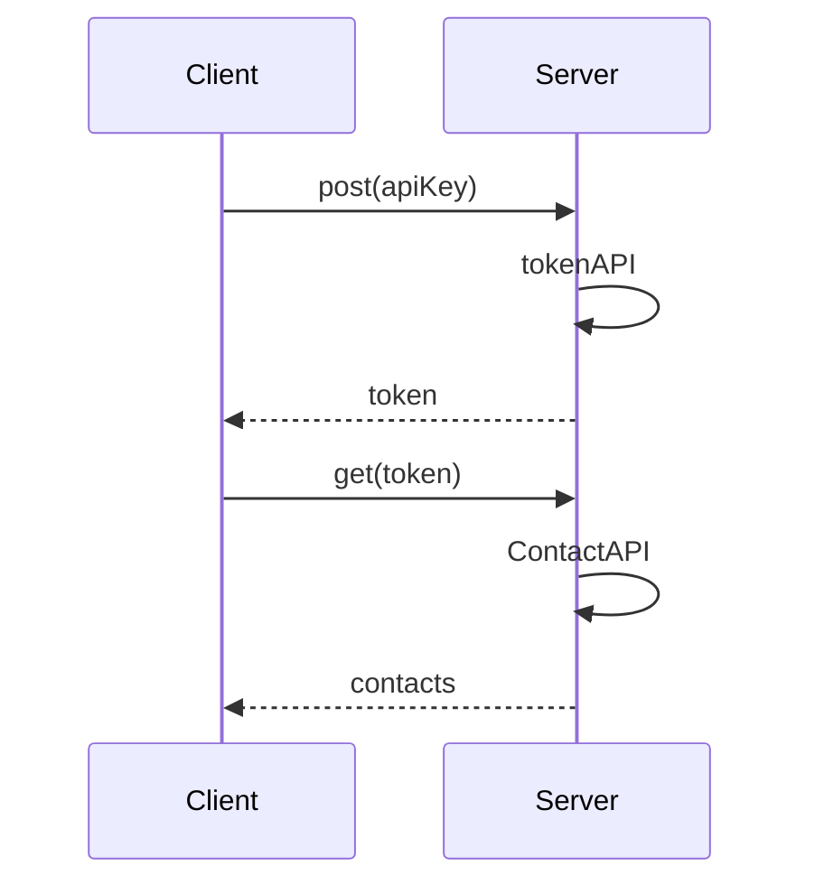

# Requirements of contacts API

## Requirements
1. Write a small, **maintainable** test suite for the **GET /contacts** endpoint.
2. The API requires authentication and exposes an auth endpoint to obtain a JWT bearer **token**.
3. Share only the source files in a **zip** file without any executables or DLLs

## Analysis

## Tasks
- [x] 1. Requirement analysis
- [x] 2. Write test plan
- [x] 3. Write test cases
- [x] 4. Postman to analyze request & response
- [x] 5. Build API automation testing framework
- [x] 6. v1: Implement test code for token and contact API
- [x] 7. v1: Integrate the testing of the 2 APIs based on fixtures
- [x] 8. v2: Refactor project architecture to three - tier 
- [x] 9. v2: Use schema to verify JSON format response
- [x] 10. v3: Add edge test cases and security test cases

## Todo List
- [x] 1. Centralized management of configuration items
- [x] 2. Add logs and detailed exception information
- [x] 3. Automatically send the test report after execution

## Challenges
+ Performance Test: Load & Stress
+ Jenkins integration
+ AOP Logger by Decorator
+ Contacts CRUD, org ,Paging
+ Read test data from database
+ Web test by Selenium 
+ App test by Appum 
+ Screen capture, pic and video
+ AI test
+ Use interface to define get, post, delete, and put
