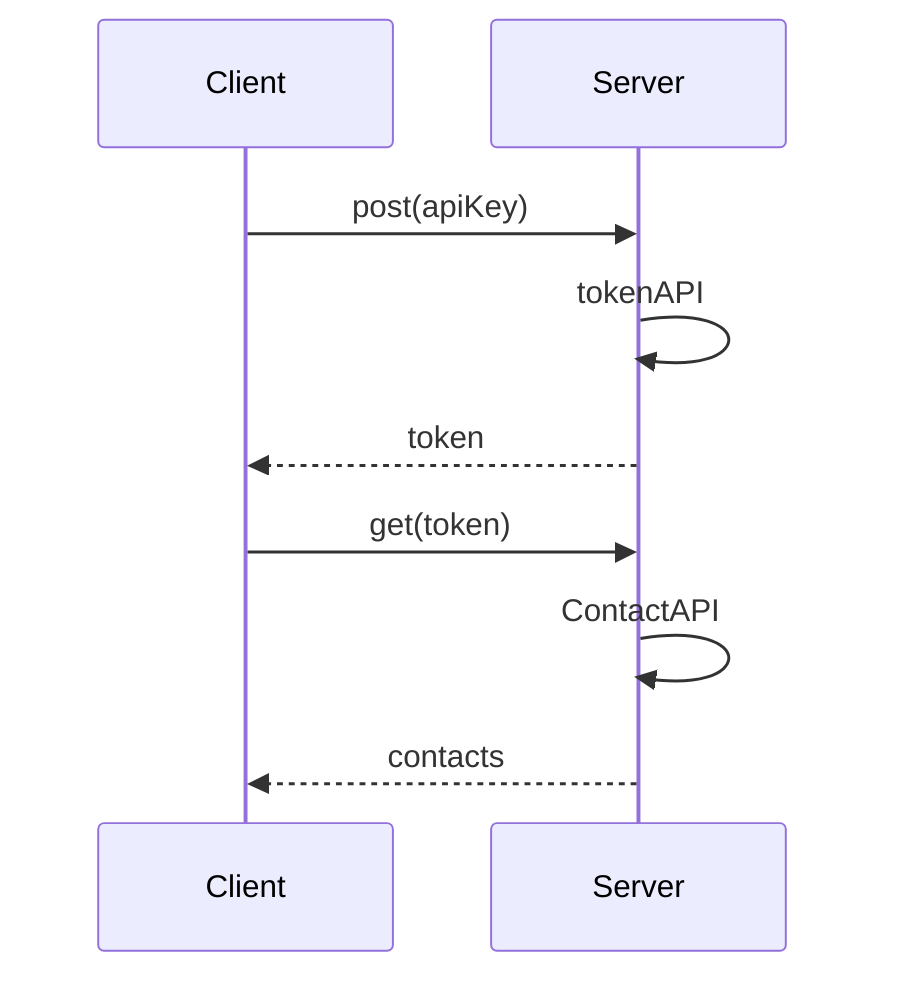

# Requirements of contacts API

## Requirements
1. Write a small, **maintainable** test suite for the **GET /contacts** endpoint.
2. The API requires authentication and exposes an auth endpoint to obtain a JWT bearer **token**.
3. Share only the source files in a **zip** file without any executables or DLLs

## Analysis

## Tasks
- [x] Requirement analysis
- [x] Write test plan
- [x] Write test cases
- [x] Postman to analyze request & response
- [x] v1.0
    - Build API automation testing framework
    - Implement test code for token and contact API
    - Integrate the testing of the 2 APIs based on fixtures
- [x] v2.0
    - Refactor project architecture to three - tier 
    - Use schema to verify JSON format response
- [x] v3.0
    - Add edge test cases and security test cases
    - Centralized management of configuration items
- [x] v4.0 
    - Add logs and detailed exception information
    - Automatically send the test report after execution
- [x] v5.0     
    - Replace the original logging based on AOP

## Todo List

+ Web test by Selenium 
+ API_BASE_URL in config.py

## Challenges
+ Performance Test: Load & Stress
+ Jenkins integration
+ Contacts CRUD, org ,Paging
+ Read test data from database
+ App test by Appum 
+ Screen capture, pic and video
+ Use interface to define get, post, delete, and put
+ Cypress and Playwright