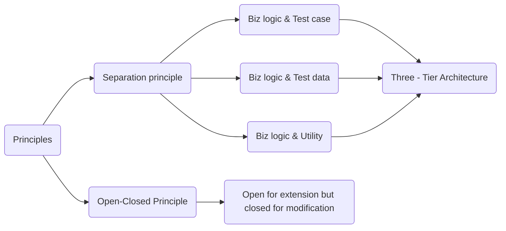

# Python Coding Standards

## 1. Project Name
PAT: Python Automation(Art) Test

## 2. Development Environment
- VSCode
- Github
- Python
- Pytest
- Selenium
- Pytest-html

## 3. Project Dependencies
- All external dependency packages are in the requirements.txt.
- Command to update the dependency information file:
`pipreqs . --encoding=utf8 --force`
- Command to install dependency packages:
`pip install -r requirements.txt`

## 4. Naming Conventions
| Object | Naming Convention | Remarks |
| ---- | ---- | ---- |
| Folders | First letter in lowercase | camel |
| Files | First letter in lowercase | camel |
| Classes | First letter in uppercase | Pascal |
| Methods | First letter in lowercase | camel |

## 5. Goals & Principles

Reusable, Configurable, Extensible      ==>  Maintainable

## 6. Test Report
Run test cases and generate test report
+ Command Line:
`pytest -m "smoke or regression"`
+ VSCode Task:
    - `Ctrl+Shift+P` 
    - Tasks: Run Test Task
